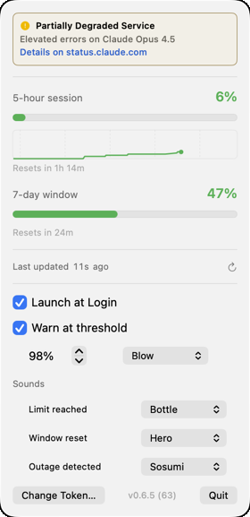
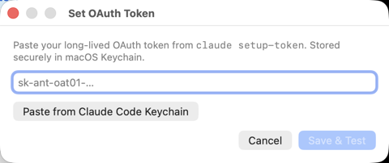

# cc-usage-stats

[](https://github.com/dmytro-vovk/cc-usage-stats/actions/workflows/ci.yml)
[](LICENSE)
[](https://github.com/dmytro-vovk/cc-usage-stats/releases/latest)
[](#install)

macOS menubar app that shows your Claude.ai 5-hour and 7-day rate-limit
usage — the same numbers Claude Desktop's **Settings → Usage** screen
displays. Live-updates regardless of whether you use Claude via the
desktop app, the web, or the CLI.

## What you see

### Menubar

<picture>
  <source media="(prefers-color-scheme: dark)" srcset="docs/screenshots/menubar-dark.png">
  
</picture>
&nbsp;&nbsp;&nbsp;&nbsp;
<picture>
  <source media="(prefers-color-scheme: dark)" srcset="docs/screenshots/menubar-outage-dark.png">
  
</picture>

- A gauge icon + percentage rendered on a colour-shifted pill — the
  pill background follows an OKLab gradient (flat green ≤50%, blending
  through orange to red at 100%), with the icon+text inverted (white in
  light mode, dark in dark mode) for high contrast against any menubar
  background.
- When the 7-day window is both **above 80% and ≥ the 5-hour fraction**,
  the pill splits into two colour-coded halves — left for the 5h
  session (gauge icon), right for the 7d window (calendar icon) — so
  you see "7d critical while 5h is fine" at a glance. Below that
  threshold the menubar stays as a slim single 5h pill.
- At 100% (5h) the percentage swaps to a live `H:MM:SS` countdown to
  the window reset (single pill again — the countdown is the headline).
- A severity-tinted SF Symbol appended to the right when
  status.claude.com reports a non-operational state, so you see an
  outage without opening the dropdown.
- A red `⚠︎` triangle (in place of the gauge) if the OAuth token is
  rejected.

### Dropdown

<picture>
  <source media="(prefers-color-scheme: dark)" srcset="docs/screenshots/dropdown-dark.png">
  
</picture>

- 5-hour and 7-day windows: title + bold gradient-coloured percentage,
  a tinted progress bar, and a `Resets in …` caption.
- For the 5-hour row, a **filled-area sparkline** of the last samples
  with a dashed forecast line projecting toward 100% based on a linear
  regression of the recent trend. Y-axis auto-zooms (25 / 50 / 75 /
  100% tiers) so the fill stays visible at low utilization. The
  caption appends `· forecast 100% in Nm` when the slope predicts a
  cap before reset. Faint dashed vertical gridlines at every wall-clock
  hour boundary inside the window.
- "Last updated Xs ago" with a small ↻ refresh button (⌘R).
- Auth / connectivity / outage rows when relevant
  (`Token rejected`, `Offline`, `No subscription rate-limit data`,
  the status.claude.com banner).
- Settings: **Launch at Login**, **Warn at threshold** (stepper
  1–99% + sound picker), and a **Sounds** section with a per-event
  picker for **Limit reached**, **Window reset**, and **Outage
  detected**. Each picker covers all 14 macOS system sounds plus a
  **None** option that mutes that single event.
- Footer: **Set Token… / Change Token…** + version label + **Quit**.

### Notification sounds

Every event has its own picker (defaults shown); selection previews the
sound, and **None** silences that one event.

- **Limit reached** — fired once when 5-hour utilization first crosses
  100%. Default: **Bottle**.
- **Window reset** — fired when the 5-hour window resets (`resets_at`
  advances). Default: **Hero**.
- **Outage detected** — fired once on the operational → outage
  transition reported by status.claude.com. Default: **Sosumi**.
- **Warn at threshold** — your chosen sound at your chosen threshold
  (e.g. Tink at 80%). Default: **Tink**.

### Set / Change OAuth Token

<picture>
  <source media="(prefers-color-scheme: dark)" srcset="docs/screenshots/settings-dark.png">
  
</picture>

The dialog opens via **Set Token…** / **Change Token…** in the
dropdown. The existing Keychain entry is left untouched until a new
token is successfully verified — cancelling leaves everything as it
was. A 401/403 from Anthropic surfaces inline; the existing-good token
is not overwritten by a bad new one.

## How it works

The app polls Anthropic's `POST /v1/messages` endpoint with a long-lived
OAuth token. Anthropic includes rate-limit headers
(`anthropic-ratelimit-unified-{5h,7d}-{utilization,reset}`) on every
successful response. The app parses those, writes them to a cache file,
and renders the menubar.

Polling cadence is adaptive:

| Utilization | Next-poll delay |
| --- | --- |
| 0–98% | 60s |
| >98% & <100% | 10s (tight tracking near the cap) |
| 100% | sleep until 30s before the window resets (≥10s minimum) |
| 429 | exponential backoff 60→120→240→…→cap 600s |
| Wake from sleep | immediate refresh (no delay) |

Roughly 9 input tokens per poll on Haiku → **sub-cent per day** of API
spend at the 60s cadence.

The OAuth token is stored in macOS Keychain (service `cc-usage-stats`,
account `oauth-token`). It is never logged or written outside Keychain.

Sample history is appended to
`~/Library/Application Support/cc-usage-stats/history.jsonl` and trimmed
to the current 5-hour window. It survives app restarts so the chart
isn't blank after relaunch.

See [docs/superpowers/specs/2026-04-25-cc-usage-stats-poller-design.md](docs/superpowers/specs/2026-04-25-cc-usage-stats-poller-design.md)
for the original v0.2 design (some details have evolved — this README
is the current source of truth).

## Install

Requires macOS 13+ and Xcode. Apple Silicon — `scripts/build.sh` produces
an arm64-only binary.

```bash
./scripts/install-dev.sh
```

Builds a Release `.app` into `dist/`, copies it to `~/Applications/`,
and launches it. Or grab a pre-built `.dmg` / `.zip` from the
[Releases page](https://github.com/dmytro-vovk/cc-usage-stats/releases)
and drop the `.app` into `/Applications/`.

On first launch the menubar shows a red ⚠︎ triangle (no token yet).
Click it → **Set Token…**. Two ways to provide a token:

- **Paste manually.** In a terminal: `claude setup-token`. Copy the
  resulting `sk-ant-oat01-…` value, paste into the SecureField, click
  **Save & Test**.
- **Read from Claude Code Keychain.** Click the **Paste from Claude
  Code Keychain** button. macOS shows a one-time access prompt; allow
  it. The field auto-populates; click **Save & Test**.

The token is then stored in our own Keychain entry; subsequent launches
don't prompt.

If you had this app's Phase 1 statusline integration installed, v2+
automatically restores your `~/.claude/settings.json` on first launch
and writes a sentinel at `~/Library/Application Support/cc-usage-stats/v2-migrated`
to make the migration idempotent.

## Uninstall

```bash
# Quit + remove the app
killall CCUsageStats 2>/dev/null
rm -rf ~/Applications/CCUsageStats.app

# Forget the OAuth token in Keychain
security delete-generic-password -s cc-usage-stats -a oauth-token

# Remove cache + history + sentinel
rm -rf ~/Library/Application\ Support/cc-usage-stats/

# (Optional) remove the dev code-signing identity created by setup-signing.sh
security delete-identity -c "CCUsageStats Dev"
```

## Privacy

- One outbound HTTPS connection per minute to `api.anthropic.com` at
  the baseline cadence; up to once every 10 seconds when within 2% of
  the cap.
- No telemetry, no analytics, no third-party servers.
- OAuth token in Keychain only. Never logged.
- On disk under `~/Library/Application Support/cc-usage-stats/`:
  - `state.json` — latest rate-limit numbers + capture timestamp.
  - `history.jsonl` — sample log for the sparkline (current 5h window only).
  - `v2-migrated` — empty sentinel.

## Scripts

```bash
./scripts/setup-signing.sh   # one-time: stable self-signed code-signing identity
./scripts/build.sh           # builds dist/CCUsageStats.app
./scripts/install-dev.sh     # build + copy to ~/Applications + relaunch
./scripts/release.sh v0.X.Y  # builds dist/v0.X.Y/{zip,dmg} for a release
```

`setup-signing.sh` is optional but recommended for local dev. Without it,
each rebuild gets a fresh ad-hoc code hash — macOS Keychain rejects the
existing OAuth-token entry's ACL after every rebuild, which surfaces in
the menubar as "Token rejected" until you re-paste. The script creates
a `CCUsageStats Dev` self-signed certificate in your login keychain so
the signature stays stable across rebuilds and the token entry is reused
indefinitely. Release artifacts (`release.sh`) always use ad-hoc signing
regardless.

## Manual test checklist

See [docs/manual-test-checklist.md](docs/manual-test-checklist.md).

## Contributing

PRs welcome. Run `xcodebuild test -scheme CCUsageStats -destination 'platform=macOS' -project CCUsageStats/CCUsageStats.xcodeproj -only-testing:CCUsageStatsTests` before submitting; the unit suite covers all the pure pieces (parser, store, poller state machine, forecast, history).

This is a personal-use app shipped to scratch one specific itch (a menubar reminder of Claude.ai usage). Don't expect a roadmap. Bug reports + small targeted PRs are the most likely things to land.

## License

MIT — see [LICENSE](LICENSE).

This project is not affiliated with or endorsed by Anthropic. "Claude" and "Claude.ai" are trademarks of Anthropic.
