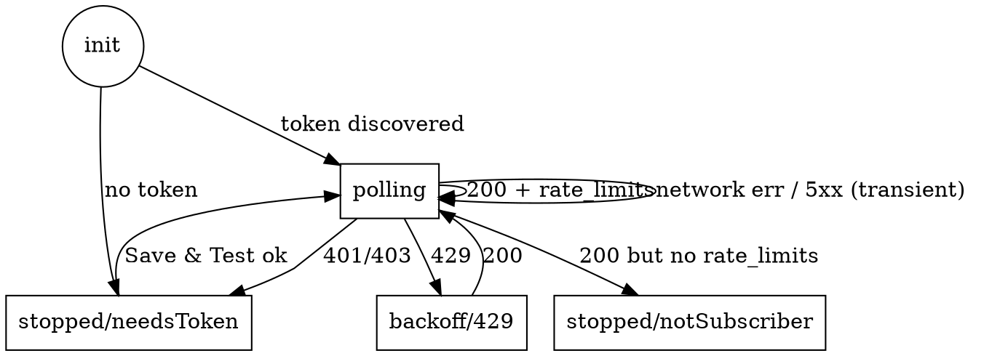

# cc-usage-stats Phase 2 — OAuth Poller — Design Spec

**Date:** 2026-04-25
**Status:** Design approved, ready for planning
**Scope:** Replace the Claude Code statusline integration with a self-polling client of the official Anthropic `/v1/messages` API, so usage is shown regardless of how the user accesses Claude (Desktop, web, or CLI).

## Goal

Display Claude.ai 5-hour and 7-day session usage in the menubar at all times — driven by an OAuth long-lived token, polling Anthropic's documented `/v1/messages` endpoint every 60 seconds. Eliminate dependence on Claude Code being actively running.

## Non-Goals

- Sub-window breakdowns (`seven_day_sonnet`, `seven_day_opus`, `seven_day_cowork`, `extra_usage`, etc.). Display stays at `five_hour` + `seven_day` only.
- Developer API-key auth (`sk-ant-api03-…`). Subscription tokens only.
- Multi-account support — token is single-user.
- Adaptive polling cadence; threshold notifications; usage history; export.
- Cross-platform support (macOS-only, unchanged from Phase 1).

## Replaces / Removes

This phase removes the Phase 1 Claude Code statusline integration:

- Code: `Statusline/StatuslineMode.swift`, `Statusline/WrappedCommand.swift`, `Tray/Installer.swift`, `Tray/CacheWatcher.swift`, all corresponding tests, and the mode-dispatch branch in `CCUsageStatsApp.swift`.
- Behavior: the binary is no longer invoked by Claude Code; there's no `cc-usage-stats statusline` subcommand.
- User state cleanup on first launch of v2.0:
  1. Check the migration sentinel `~/Library/Application Support/cc-usage-stats/v2-migrated`. If present, skip the rest of this list.
  2. If `~/.claude/settings.json` `statusLine.command` ends with `cc-usage-stats statusline`, restore the wrapped command (read from our `config.json`) by performing the same edit `Installer.uninstall` does today, then delete `config.json`.
  3. If the path-mismatch case applies (configured path differs from running binary but still ends with `cc-usage-stats statusline`), still restore by removing the `statusLine` key entirely (our config.json is the only source of truth for the previous command).
  4. Otherwise leave `~/.claude/settings.json` alone.
  5. Touch the sentinel file so step 1 short-circuits on subsequent launches.

The cache file `~/Library/Application Support/cc-usage-stats/state.json` keeps the same schema (`captured_at`, `five_hour`, `seven_day` fields). Existing UI logic is unchanged downstream of the cache.

## Architecture

Single-process timer-based poller inside the existing tray app. No separate daemon, no launchd integration, no background process. SwiftUI `MenuBarExtra` continues to host the UI; a new `UsagePoller` component runs on `@MainActor`, with a `Timer.scheduledTimer` firing every 60 seconds.

## Components

| File | Responsibility |
|------|----------------|
| `Auth/TokenStore.swift` | Read/write our OAuth token in macOS Keychain (`SecItem*`, generic-password class, `kSecAttrAccessibleWhenUnlockedThisDeviceOnly`). |
| `Auth/ClaudeCodeKeychainProbe.swift` | Best-effort one-shot read of the existing `Claude Code-credentials` Keychain entry (service `Claude Code-credentials`, account `Claude`). Returns `String?`. macOS shows a native Keychain access prompt the first time; user can deny. |
| `Auth/SettingsWindow.swift` | Floating SwiftUI window with `SecureField` for the token, "Paste from Claude Code Keychain" button, "Save & Test" button, "Cancel". |
| `Poller/AnthropicAPI.swift` | Builds `URLRequest` for `POST /v1/messages`, invokes `URLSession.shared.data(for:)`, parses `rate_limits` from the response. |
| `Poller/UsagePoller.swift` | `@MainActor` state machine. Owns the timer, calls `AnthropicAPI.fetchRateLimits()`, updates `CacheStore`. Surfaces `authState` to `MenuViewModel`. |
| `Poller/AuthState.swift` | Enum: `.unknown | .ok | .invalidToken | .notSubscriber | .offline`. |

Existing components reused:
- `Core/RateLimits.swift` — `RateLimitsSnapshot` schema. The poller may need a translation layer if Anthropic returns different field names; details settled in plan Task 1.
- `Core/CacheStore.swift` — atomic write + merge. Unchanged.
- `Core/DisplayState.swift` — pure UI state derivation. Unchanged.
- `Tray/MenuViewModel.swift` — gains `@Published authState`; loses install-state, path-mismatch, wrapped-command, cache-watcher concerns.
- `Tray/MenuBarContent.swift` — drops install/uninstall rows, drops path-mismatch warning; gains "Set Token… / Reset Token…" row and a token-error row.
- `Tray/LaunchAtLoginService.swift`, `Tray/RelativeTime.swift` — unchanged.

## Data Flow

```
appStart()
   │
   ├── TokenStore.read() → got token? ───────────────────────┐
   │                                                         │
   ├── nope → ClaudeCodeKeychainProbe.read() → got token? ──┤
   │                                                         │
   ├── nope → authState = .invalidToken; show "Set Token…"   │
   │                                                         │
   │                                                         ▼
   │                                                   startPolling()
   │                                                         │
   ▼                                                         │
                                                             ▼
                                       Timer.scheduledTimer(60.0)
                                                             │
                                                             ▼
                                       UsagePoller.tick()
                                                             │
            ┌────────────────────────────────────────────────┤
            ▼                                                ▼
  AnthropicAPI.fetchRateLimits()              NSWorkspace.didWakeNotification
            │                                                │
            ▼                                                │
  HTTP POST /v1/messages ──── 200 + body ────────────────────┤
            │                                                │
            └─ parsed RateLimitsSnapshot                     │
                       │                                     │
                       ▼                                     │
              CacheStore.update(snapshot, now)               │
                       │                                     │
                       ▼                                     │
              MenuViewModel reload (existing path)           │
                       │                                     │
                       ▼                                     │
              MenuBarLabel/Dropdown re-renders               │
                                                             │
            (Failure paths handled by error-handling table.) │
                                                             │
                                                             ▼
                                                       extra immediate tick
```

## Anthropic API Contract

### Request

```http
POST https://api.anthropic.com/v1/messages
Authorization: Bearer <token>
anthropic-version: 2023-06-01
anthropic-beta: oauth-2025-04-20    [conditional — see "Verification step" below]
content-type: application/json

{
  "model": "claude-haiku-4-5",
  "max_tokens": 1,
  "messages": [{"role":"user","content":"."}]
}
```

The cheapest available subscription-billed model is preferred (Haiku 4.5). If the token's plan does not authorize Haiku, fall back to `claude-sonnet-4-5`.

### Response — two source paths

The plan's first task **must verify empirically** which form Anthropic uses to expose subscription rate-limit data on the `/v1/messages` endpoint:

- **Path A — JSON body field.** Response body contains a top-level `rate_limits` object matching the structure Claude Code's statusline schema documents:
  ```jsonc
  {
    "id": "msg_…", "type": "message", "role": "assistant",
    "content": [...], "model": "...", "stop_reason": "...",
    "rate_limits": {
      "five_hour":  { "used_percentage": <num>, "resets_at": <unix-epoch-seconds> },
      "seven_day":  { "used_percentage": <num>, "resets_at": <unix-epoch-seconds> }
    }
  }
  ```
- **Path B — response headers.** Custom headers like `anthropic-ratelimit-five-hour-percentage` / `anthropic-ratelimit-five-hour-resets-at` (and seven-day equivalents). Field names will be discovered during verification.

If both paths are present, prefer JSON body. If neither is present after a successful 200 response, treat it as `notSubscriber`.

### Cost

`max_tokens: 1` minimizes output tokens. Input cost dominated by the prompt (`.` plus model overhead, ~10 tokens). At 60-second polling that's ~14,400 tokens/day — negligible cost (sub-cent on Haiku) and a measurable but tiny self-referential bump on the 5h window.

## Auth Flow

### Token discovery on app start

1. `TokenStore.read()` → if found, accept and start polling.
2. Otherwise try `ClaudeCodeKeychainProbe.read()`. The first call surfaces a macOS Keychain "Allow access?" prompt for the `Claude Code-credentials` entry. On allow + valid token format, copy into our entry and start polling. On deny, on absent entry, or on bad format, do not retry the probe automatically — go to step 3.
3. `authState = .invalidToken`. Menubar shows error icon. Dropdown shows "Set Token…" button which opens `SettingsWindow`.

### `SettingsWindow` flow

- Single `SecureField` (masked) for the token.
- "Paste from Claude Code Keychain" button: re-runs `ClaudeCodeKeychainProbe.read()`. On success, populates the field. (The user can press it after revoking the prompt earlier.)
- "Save & Test" button:
  1. Token-format check (heuristic — Anthropic may rotate the prefix): must start with `sk-ant-oat01-`. Reject `sk-ant-api03-` (developer API keys) with the error "Use a long-lived OAuth token from `claude setup-token`, not an API key." If a future prefix breaks this check, the user can bypass with a "Use anyway" affordance — out of scope for v2.0; today the check is hard.
  2. Write to our Keychain entry via `TokenStore.write`.
  3. Synchronously fire one `UsagePoller.tick()`. On 200 → close window, set `authState = .ok`, schedule the regular timer. On 401/403/parse-error → keep window open, show error inline; do not start the timer.
- "Cancel" → close, no changes.

### Storage

- `kSecClass = kSecClassGenericPassword`
- `kSecAttrService = "cc-usage-stats"`
- `kSecAttrAccount = "oauth-token"`
- `kSecAttrAccessible = kSecAttrAccessibleWhenUnlockedThisDeviceOnly`

The token is never written to disk outside the Keychain. It is never logged.

## State Machine



## Error Handling

| Scenario | Behavior |
|---|---|
| 200 + parsed `rate_limits` | Update cache, `authState = .ok`. |
| 200 + missing `rate_limits` (body and headers) | Log once at info; `authState = .notSubscriber`; stop the timer. Dropdown row: "Account has no Claude.ai subscription rate limits." |
| 401 / 403 | `authState = .invalidToken`; stop the timer. Red `exclamationmark.gauge` icon. Dropdown row: "Token rejected. Set Token…" |
| 429 | Exponential backoff: 60s → 120s → 240s, capped 600s. On next 200 reset to 60s. |
| Network down / DNS / timeout | Silent retry on next tick. After 5 consecutive failures, set `authState = .offline` (icon stays its last-known tier color; dropdown shows an "Offline" tag). On next 200, transition back to `.ok`. |
| Body parse error | Log; treat as transient, same as network error. |
| App resumed from sleep | `NSWorkspace.didWakeNotification` triggers an immediate `tick()`. |
| User pasted API key (`sk-ant-api03-…`) | Reject in `SettingsWindow` before writing Keychain. |

`UsagePoller` is `@MainActor`. URLSession runs the request on a background queue and the response delegate hops back to main for state mutation.

## UI Changes

### Dropdown (final layout)

```
─────────────────────────────────
5h session     42%   resets in 2h 14m
7-day window   18%   resets in 5d 6h
─────────────────────────────────
Last update    34s ago
─────────────────────────────────
☑ Launch at Login
Set Token…   /   Reset Token…
[Token rejected. Set Token…]            ← shown only on .invalidToken
[Offline]                               ← shown only after 5+ failures
─────────────────────────────────
Quit
```

Removed rows: "Install Statusline Integration", "Uninstall Statusline Integration", path-mismatch warning, errors from those flows.

### Menubar label

Same gauge-icon + percentage + tier color as Phase 1, with one extension:
- `authState == .invalidToken` → SF Symbol `exclamationmark.gauge`, red, no percentage text.
- `authState == .notSubscriber` → SF Symbol `gauge.with.dots.needle.0percent`, dimmed, "—" text.

## Testing Strategy

| Layer | Approach |
|------|----------|
| `TokenStore` | Integration test round-tripping through the real Keychain in the test runner's user keychain (cleaned up in tearDown). Documented manual smoke for the access prompt. |
| `ClaudeCodeKeychainProbe` | Manual smoke only — Keychain access prompts can't be exercised in CI. |
| `AnthropicAPI` parser | Unit tests with fixture JSON: body-rate-limits, headers-rate-limits, no-rate-limits, malformed JSON. |
| `UsagePoller` state machine | Unit tests with a stubbed `AnthropicAPI` injected at construction time: 200 → continue; 401 → stop + state; 429 → backoff schedule; missing-rate-limits → notSubscriber. |
| `SettingsWindow` | Manual smoke — paste, validation rejection of API keys, Save & Test wiring. |
| Phase 1 cleanup migration | Test by snapshot: pre-migration `~/.claude/settings.json` with our installed command + a `config.json` with wrapped command → run migration → assert settings.json restored to wrapped command and config.json deleted. |
| End-to-end | Manual: real OAuth token from `claude setup-token`, app starts, dropdown updates within ~60 s. |

## Open Questions for Implementation Plan

1. **Verification of `rate_limits` source path.** Plan Task 1: have the implementer (or user) curl `/v1/messages` with the user's OAuth token and a tiny payload, capture both response headers and JSON body. Lock the parser path and field names from observed reality. The two-path implementation in `AnthropicAPI` parses whichever it finds.
2. **`anthropic-beta: oauth-2025-04-20` header.** Verify whether OAuth tokens require this beta header on `/v1/messages`. Adjust at plan Task 1.
3. **Model availability per plan tier.** If Haiku 4.5 is rejected by the user's plan, fall back to Sonnet 4.5. Verify acceptable path on first connect.
4. **Migration timing.** Run the Phase 1 cleanup synchronously on first v2.0 launch. Mark a sentinel in `~/Library/Application Support/cc-usage-stats/v2-migrated` so we don't re-run.

## Out of Scope (Reaffirmed)

- Sub-window display (sonnet, opus, cowork, extra_usage).
- API key support.
- Cross-machine sync.
- Threshold-based notifications.
- Polling-cadence preferences.
- Multi-account.
- A history graph.
